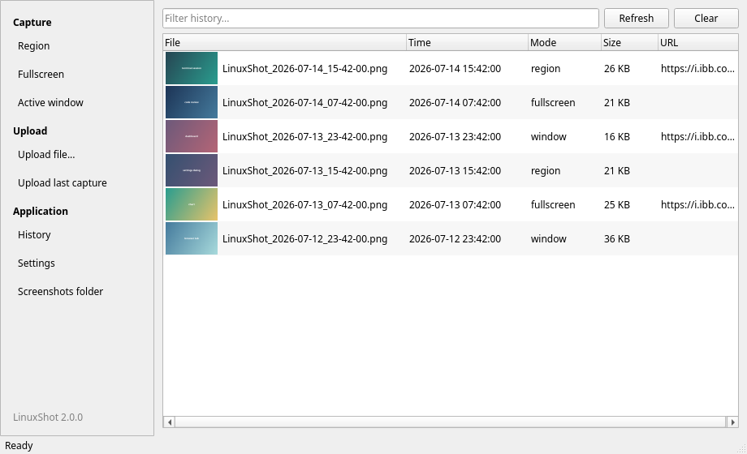
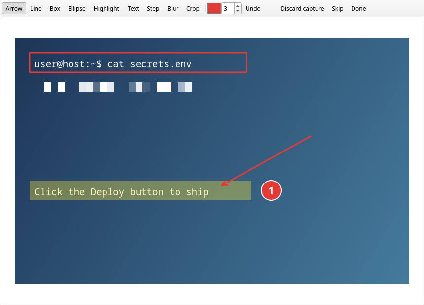
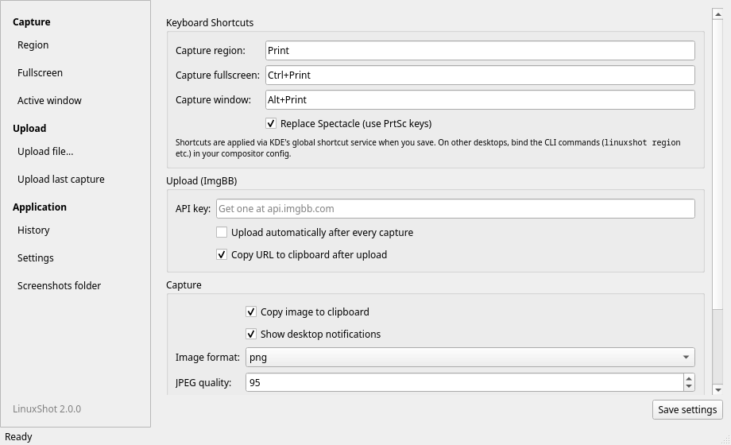

<div align="center">

# LinuxShot

**A ShareX-inspired screenshot and upload tool for Linux.**

[](https://github.com/TaintedAngel/linuxshot/actions/workflows/ci.yml)
[](https://github.com/TaintedAngel/linuxshot/releases)
[](LICENSE)


Capture a region, fullscreen, or window with a single keypress, auto-upload to **ImgBB**, and get a direct `i.ibb.co` link on your clipboard. Works on both **Wayland** and **X11**.



</div>

## Features

- Region, fullscreen, and active window capture (PrtSc / Ctrl+PrtSc / Alt+PrtSc)
- **Annotation editor** after every capture: arrows, boxes, text, highlights, numbered steps, crop, and **blur** for redacting secrets before anything leaves your machine
- Upload to **ImgBB, Imgur, catbox.moe, 0x0.st**, or any self-hosted service via a custom HTTP uploader
- Delete links are kept in history, so an upload is never irreversible
- ShareX-style main window: action sidebar, searchable capture history with thumbnails, settings
- Global keyboard shortcuts on KDE Plasma via KGlobalAccel
- Desktop notifications on capture and upload
- System tray icon with quick-capture context menu
- Full CLI for scripting and compositor keybinds
- Self-update: `linuxshot update`
- Works on Arch/CachyOS, Debian/Ubuntu, Fedora, openSUSE, Void

## Install

### Quick Install (recommended)

```bash
git clone https://github.com/TaintedAngel/linuxshot.git
cd linuxshot
chmod +x setup.sh
./setup.sh
```

The setup script will:
1. Detect your distro and display server
2. Install all system dependencies automatically
3. Install LinuxShot via pip
4. Set up the desktop file for your app launcher

### Manual Install

```bash
# Arch / CachyOS
sudo pacman -S python python-pip python-gobject python-pyside6 python-dbus \
    python-requests libnotify grim slurp wl-clipboard

# Debian / Ubuntu
sudo apt install python3 python3-pip python3-gi python3-pyside6 python3-dbus \
    python3-requests libnotify-bin grim slurp wl-clipboard

# Fedora
sudo dnf install python3 python3-pip python3-gobject python3-pyside6 python3-dbus \
    python3-requests libnotify grim slurp wl-clipboard

# Then install LinuxShot
pip install .
```

### For X11 users

Replace the Wayland tools with X11 equivalents:

```bash
# Arch / CachyOS
sudo pacman -S maim xdotool xclip

# Debian / Ubuntu
sudo apt install maim xdotool xclip

# Fedora
sudo dnf install maim xdotool xclip
```

## Usage

### CLI Commands

```
linuxshot region          Capture a selected region
linuxshot fullscreen      Capture the entire screen
linuxshot window          Capture the active window
linuxshot edit <file>     Annotate an image in the editor
linuxshot upload <file>   Upload a file
linuxshot upload-last     Upload the most recent capture
linuxshot history         Show recent capture history
linuxshot config          View/edit configuration
linuxshot tray            Start the system tray icon
linuxshot gui             Open the main window
linuxshot setup           Register shortcuts, desktop file & autostart (KDE)
linuxshot update          Update to the latest version from GitHub
linuxshot check           Verify all dependencies
```

Running plain `linuxshot` starts the tray.

### Annotation Editor

After each capture the editor opens (turn this off in Settings or with
`linuxshot config --set open_editor_after_capture false`):



Arrow, line, box, ellipse, highlight, text, numbered steps, crop — plus
**blur** (soft, cosmetic) and **pixelate** (coarse mosaic). Use pixelate
for credentials and personal data: gaussian blur only smears information
and blurred text has been reconstructed before, while the mosaic
averages each block away for good. **Done** applies your annotations, **Skip** keeps
the capture untouched, **Discard** throws it away. Ctrl+Z undoes,
Ctrl+scroll zooms. Existing images can be annotated any time via
`linuxshot edit` or right-click → Edit in the history.

### Main Window

```bash
linuxshot gui
```

Laid out like ShareX: capture and upload actions in a sidebar on the left,
your capture history on the right. History entries have thumbnails, a
filter box, and a right-click menu (open, copy image, copy URL, upload,
delete). Settings live on their own page in the same window.



### System Tray

```bash
linuxshot tray
```

Right-click the tray icon for quick actions: capture, upload, toggle auto-upload, open the screenshots folder. Left-click toggles the main window.

To auto-start the tray on login, run `linuxshot setup` (KDE) or add `linuxshot tray` to your compositor/DE autostart config.

## Keyboard Shortcuts

### KDE Plasma (automatic)

On KDE Plasma 6, LinuxShot can register global shortcuts automatically:

```bash
linuxshot setup
```

This registers PrtSc / Ctrl+PrtSc / Alt+PrtSc (replacing Spectacle), installs the desktop file, and sets up autostart. You can also change shortcuts on the Settings page of the main window.

### Other desktop environments (manual)

Bind these commands to your preferred keys:

#### Hyprland (`~/.config/hypr/hyprland.conf`)
```
bind = , Print, exec, linuxshot region
bind = CTRL, Print, exec, linuxshot fullscreen
bind = ALT, Print, exec, linuxshot window
```

#### Sway (`~/.config/sway/config`)
```
bindsym Print exec linuxshot region
bindsym Ctrl+Print exec linuxshot fullscreen
bindsym Alt+Print exec linuxshot window
```

#### i3 (`~/.config/i3/config`)
```
bindsym Print exec --no-startup-id linuxshot region
bindsym Ctrl+Print exec --no-startup-id linuxshot fullscreen
bindsym Alt+Print exec --no-startup-id linuxshot window
```

#### GNOME
```bash
gsettings set org.gnome.settings-daemon.plugins.media-keys custom-keybindings "['/org/gnome/settings-daemon/plugins/media-keys/custom-keybindings/linuxshot-region/']"
gsettings set org.gnome.settings-daemon.plugins.media-keys.custom-keybinding:/org/gnome/settings-daemon/plugins/media-keys/custom-keybindings/linuxshot-region/ name 'LinuxShot Region'
gsettings set org.gnome.settings-daemon.plugins.media-keys.custom-keybinding:/org/gnome/settings-daemon/plugins/media-keys/custom-keybindings/linuxshot-region/ command 'linuxshot region'
gsettings set org.gnome.settings-daemon.plugins.media-keys.custom-keybinding:/org/gnome/settings-daemon/plugins/media-keys/custom-keybindings/linuxshot-region/ binding 'Print'
```

## Configuration

Config is stored at `~/.config/linuxshot/config.json`.

### View all settings

```bash
linuxshot config
```

### Common config tweaks

```bash
# Set your ImgBB API key (get one at https://api.imgbb.com/)
linuxshot config --set imgbb_api_key YOUR_API_KEY

# Enable auto-upload after every capture
linuxshot config --set auto_upload true

# Change image format to JPEG
linuxshot config --set image_format jpg

# Set a capture delay (seconds)
linuxshot config --set capture_delay 3

# Change screenshot save directory
linuxshot config --set screenshot_dir /path/to/screenshots

# Reset everything to defaults
linuxshot config --reset
```

### Upload destinations

Pick a destination on the Settings page or with
`linuxshot config --set upload_service <name>`:

| Service  | Needs                | Delete link kept |
| -------- | -------------------- | ---------------- |
| `imgbb`  | API key (api.imgbb.com) | yes           |
| `imgur`  | client ID (api.imgur.com/oauth2/addclient) | yes |
| `catbox` | nothing (userhash optional) | with userhash |
| `0x0`    | nothing              | yes (token)      |
| `custom` | a JSON request spec  | if mapped        |

A one-off upload can override the default: `linuxshot upload -s imgur shot.png`.

The custom uploader covers self-hosted services (Zipline, Chibisafe, ...).
Describe the request in the `custom_uploader` config key:

```json
{
  "request_url": "https://host/api/upload",
  "file_form_name": "file",
  "headers": {"Authorization": "..."},
  "response_type": "json",
  "url_key": "files.0.url",
  "delete_url_key": ""
}
```

For services that answer with a plain-text URL, use `"response_type": "text"`.

### Key config options

- `upload_service` - destination: `imgbb`, `imgur`, `catbox`, `0x0`, `custom` (default: imgbb)
- `imgbb_api_key` - your ImgBB API key (get one at https://api.imgbb.com/)
- `auto_upload` - upload after every capture (default: false)
- `open_editor_after_capture` - annotate before the after-capture steps run (default: true)
- `screenshot_dir` - save location (default: `~/Pictures/LinuxShot`)
- `image_format` - `png`, `jpg`, or `webp` (default: png)
- `copy_image_to_clipboard` - copy image to clipboard (default: true)
- `copy_url_to_clipboard` - copy URL after upload (default: true)
- `show_notification` - desktop notifications (default: true)
- `shortcut_region` / `shortcut_fullscreen` / `shortcut_window` - key bindings
- `override_spectacle` - replace Spectacle's PrtSc on KDE (default: true)

## Dependencies

### Wayland
- `spectacle` (KDE), `gnome-screenshot` (GNOME), or `grim` + `slurp` (wlroots)
- `wl-clipboard` - clipboard (wl-copy / wl-paste)

### X11
- `maim` - screenshot capture
- `xdotool` - active window detection
- `xclip` - clipboard

### Common
- Python 3.10+
- PySide6 (Qt6 GUI and tray)
- PyGObject + dbus-python (KDE global shortcut listener)
- requests
- libnotify (notify-send)

Run `linuxshot check` to verify everything is installed.

## Uninstall

```bash
./uninstall.sh
```

Or manually:

```bash
pip uninstall linuxshot
rm ~/.local/share/applications/linuxshot.desktop
```

## Updating

```bash
linuxshot update
```

Or manually:

```bash
pip install --upgrade git+https://github.com/TaintedAngel/linuxshot.git
```

## Development

```bash
pip install -e .[dev]
pytest          # run the test suite
ruff check .    # lint
```

The test suite covers the core modules (config, history, upload, capture
backend selection, CLI) and runs without a display or the Qt/DBus stack,
so it works in CI. GUI changes should be checked by hand with
`linuxshot gui` and `linuxshot tray`.

## License

GPL-3.0, same as ShareX.

## Contributing

Pull requests welcome! Ideas:

- Image annotation overlay
- OCR via Tesseract
- Screen recording via wf-recorder/ffmpeg
- More upload destinations
